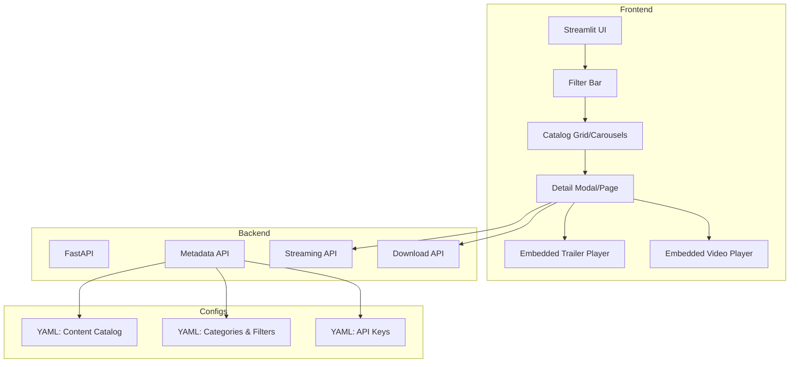

# Mac Flix — Planning & Architecture

---

## High-Level Goals

- Deliver a simple, modular MVP for browsing, streaming, and downloading movies/TV shows
- Use a **config-driven, declarative design** for easy expansion
- Prioritize **portability, reproducibility, and security**
- Lay a foundation for future features like user accounts, recommendations, adaptive streaming

---

## Architecture Principles

- **Strictly modular**: separate backend, frontend, configs, tests
- **Config-driven**: all domain logic externalized to YAML
- **Validated configs**: Pydantic models enforce schema correctness
- **Declarative workflows**: minimal hardcoding, easy to update
- **Portability**: Podman containerization
- **Reproducibility**: pip-tools for dependency management
- **Security**: secrets via `.env`, secure file handling
- **Maintainability**: clear docs, comments, type hints, tests

---

## Technology Stack

| Layer            | Technology                     | Purpose                                         |
|------------------|-------------------------------|-------------------------------------------------|
| **Backend API**  | FastAPI                       | Metadata, streaming, download endpoints         |
| **Frontend**     | Streamlit                     | UI prototype with embedded players              |
| **Configs**      | YAML + Pydantic               | Content catalog, filters, API keys              |
| **Container**    | Podman                        | Portability, security                           |
| **Testing**      | Pytest                        | Unit and integration tests                      |
| **Data Source**  | TMDB API                      | Metadata, trailers                              |

---

## MVP Architecture Diagram

---

## Future Considerations

- Replace Streamlit with React/Vue frontend for production
- Add user accounts, watchlists, recommendations
- Implement adaptive streaming (HLS/DASH)
- Integrate cloud storage (S3, etc.)
- Add scraping, vector memory, agentic workflows
- Enhance security and access controls

---

_Last updated: 2025-04-09_
